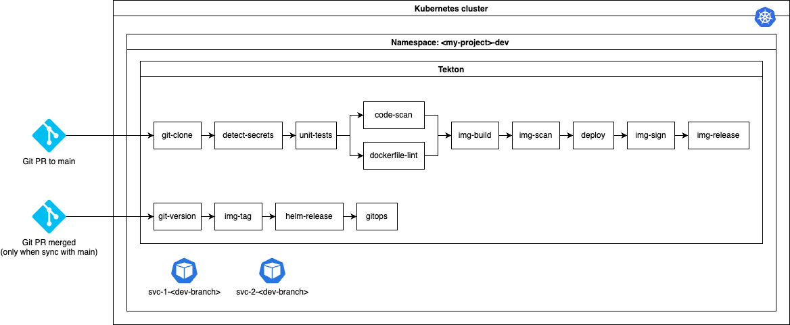

# Tetkon Resources

General purpose Tekton resources for DevSecOps on Kubernetes.

## Concept

The goal of this project is to provide an easy to use set of tools to implement modern DevSecOps practices on Kubernetes (or Red Hat OpenShift).

The implemented pipeline is the following:



## Tekton Hub Tasks

Some of the Tekton tasks we use are based on Tekton Hub to reduce maintenance footprint, the following shows how to retrieve these tasks.

Prereqs:
- [Tekton CLI](https://tekton.dev/docs/cli/): `tkn`

```sh
tkn hub get task git-clone --version 0.9 > tasks/git-clone/git-clone.yaml
tkn hub get task sonarqube-scanner --version 0.4 > tasks/code-scan/code-scan.yaml
tkn hub get task hadolint --version 0.1 > tasks/dockerfile-lint/dockerfile-lint.yaml
tkn hub get task buildah --version 0.5 > tasks/img-build/img-build.yaml
tkn hub get task trivy-scanner --version 0.2 > tasks/img-scan/img-scan.yaml
```

## Prerequisites

This set of Tekton tasks relies on third party Open Source software:
- [SonarQube](https://docs.seillama.dev/kubernetes/software/sonarqube)

## Getting started

1. Create your development namespace, and make it current namespace:
    ```sh
    export DEV_NAMESPACE=<CHANGE_ME>
    kubectl create ns ${DEV_NAMESPACE}
    kubeclt ns ${DEV_NAMESPACE}
    ```
2. Clone this repo:
    ```sh
    git clone https://github.com/seillama-io/tekton-resources
    ```
3. Create Tekton resources:
    ```sh
    kubectl apply -f tasks/git-clone/git-clone.yaml
    kubectl apply -f tasks/detect-secrets/detect-secrets.yaml
    kubectl apply -f tasks/code-scan/code-scan.yaml
    kubectl apply -f tasks/dockerfile-lint/dockerfile-lint.yaml
    kubectl apply -f tasks/img-build/img-build.yaml
    kubectl apply -f pipelines/general.yaml
    ```
4. Configure Tekton run resources from given template:
    ```sh
    export GIT_URL=<YOUR_GIT_REPO_URL>
    export GIT_USERNAME=<YOUR_GIT_USERNAME>
    export GIT_TOKEN=<YOUR_GIT_PERSONNAL_ACCESS_TOKEN>
    export APP_NAME=<YOUR_APP_NAME>
    export SONAR_USERNAME=<SONARQUBE_USERNAME>
    export SONAR_PASSWORD=<SONARQUBE_PASSWORD>
    cp -R run-template run
    yq -i '.stringData.username = env(GIT_USERNAME) | .stringData.password=env(GIT_TOKEN)' run/credentials.yaml
    yq -i '.spec.params[0].value = env(GIT_URL)' run/prun.yaml
    yq -i '.spec.params[1].value = env(APP_NAME)' run/prun.yaml
    kubectl apply -f run/credentials.yaml
    kubectl apply -f run/pvc.yaml
    kubectl create secret generic sonar-credentials --from-literal login=${SONAR_USERNAME} --from-literal password=${SONAR_PASSWORD}
    ```
5. Allow `pipeline` service account to use Git credentials:
    ```sh
    kubectl get sa pipeline -o yaml | yq '.secrets += {"name": "pipeline-credentials"}' | kubectl apply -f -
    ```
6. Start pipeline:
    ```sh
    kubectl create -f run/prun.yaml
    ```
